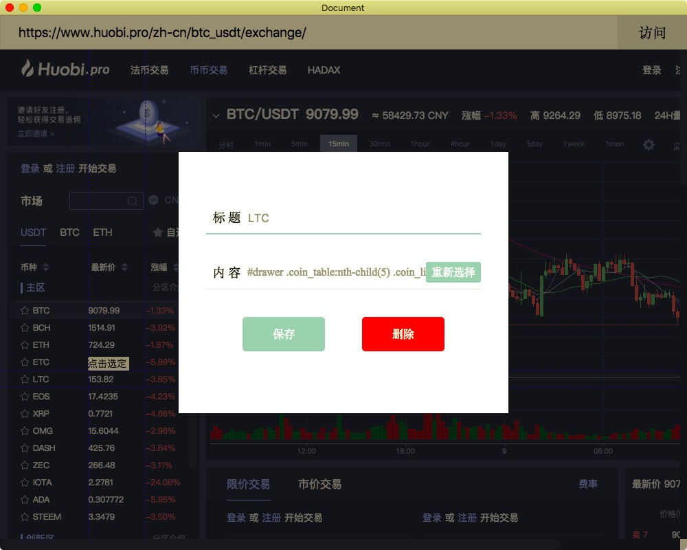
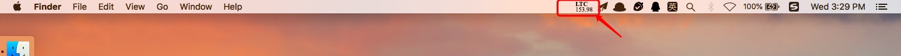
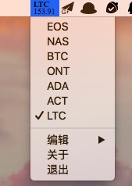

## info
---
### #[下载本软件](https://github.com/fftaken/info/releases)

### #重要提醒
```
1.目前仅支持Mac OS
2.信息展示有10个字符限制，所以超过长度的在页面上无法选择
3.本软件在新增配置界面会劫持点击事件，所以可能无法在新增界面点击链接跳转到新页面
```
### 关于
---
info是一个放在系统托盘区域的一段简短信息，基于Electron实现

---
### 运行截图 


### 功能说明
---
目前只有最基本的功能
1. 多个信息管理
2. 每2秒刷新网页获取网页指定元素内容
3. 显示某个指定信息到托盘区域

正在开发中的功能
* 自定义刷新时间
* 同时显示多个信息（两个或以上）
* 信息显示多个样式可自由选择（例如现在是两行文字，上面是标题下面是信息，将会增加单行显示、只显示内容等样式选择）

预备开发的功能
* 增加通过接口获取数据选项

如果你有好的想法，可以[告诉我](https://github.com/fftaken/info/issues)
### 使用中出现问题？
---
请在[这里](https://github.com/fftaken/info/issues)反馈问题

